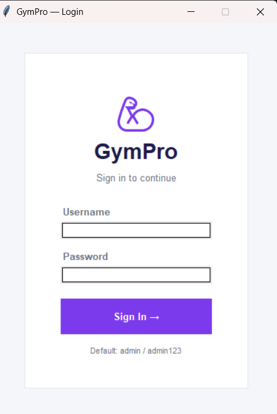
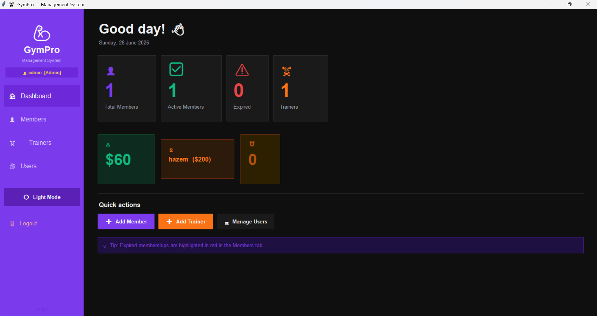
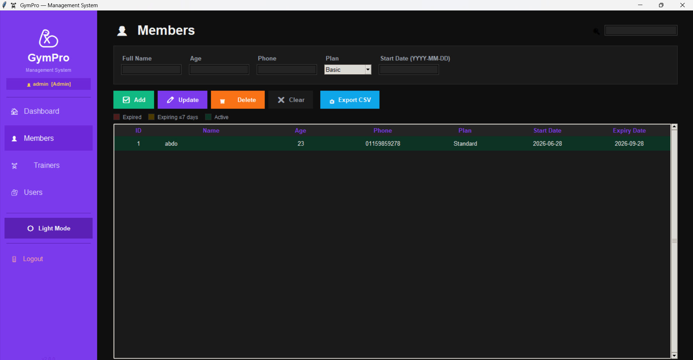
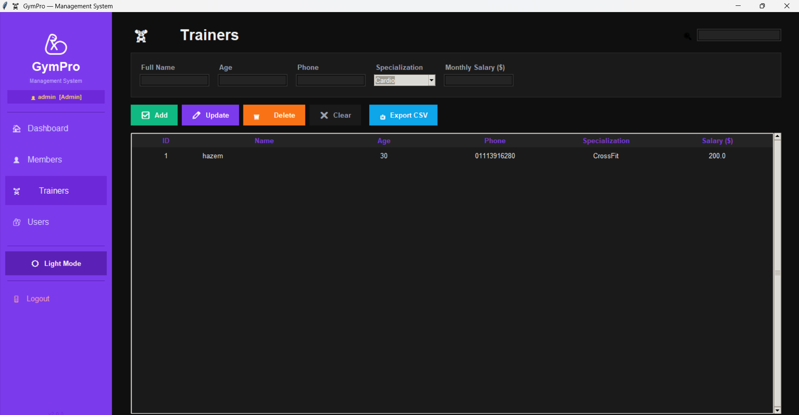
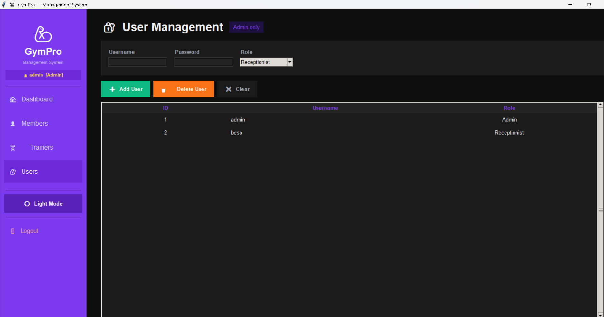

# 🏋️ GymPro Management System

A modern Gym Management System built with **Python**, **Tkinter**, **SQLite**, and **Object-Oriented Programming (OOP)**.

This desktop application helps gym administrators efficiently manage members, trainers, users, and gym operations through an intuitive graphical interface.

---

## ✨ Features

- 🔐 User Authentication
- 👥 Member Management
- 🏋️ Trainer Management
- 👨‍💼 User Management
- 📊 Dashboard
- 💾 SQLite Database
- 🎨 Modern GUI using Tkinter
- 🧩 Object-Oriented Programming (OOP)

---

## 📸 Screenshots

| Login | Dashboard |
|-------|-----------|
|  |  |

| Members | Trainers |
|---------|----------|
|  |  |

| Users |
|-------|
|  |

---

## 🛠️ Technologies Used

- Python
- Tkinter
- SQLite
- Object-Oriented Programming (OOP)

---

## 🚀 Installation

### 1. Clone the repository

```bash
git clone https://github.com/abdelrahman-ahmed03/GymPro-Management-System.git
```

### 2. Navigate to the project folder

```bash
cd GymPro-Management-System
```

### 3. Install dependencies

```bash
pip install -r requirements.txt
```

### 4. Run the application

```bash
python main.py
```

---

## 📂 Project Structure

```
GymPro-Management-System
│
├── assets/
│   ├── login.png
│   ├── dashboard.png
│   ├── members.png
│   ├── trainers.png
│   └── users.png
│
├── database/
│
├── dashboard.py
├── database.py
├── main.py
├── members.py
├── models.py
├── styles.py
├── trainers.py
├── users.py
├── utils.py
├── requirements.txt
└── README.md
```

---

## 🎯 Project Goals

- Practice Object-Oriented Programming (OOP)
- Build a complete desktop GUI application
- Learn SQLite database integration
- Apply CRUD operations
- Organize Python projects professionally

---

---

## 👨‍💻 Author

**Abdelrahman Ahmed**

- AI Engineer
- Data Analyst

### 📫 Connect with me

- GitHub: https://github.com/abdelrahman-ahmed03
- LinkedIn: https://www.linkedin.com/in/abdelrahman-ahmed-ai

---

## ⭐ Support

If you found this project helpful, please consider giving it a ⭐ on GitHub.